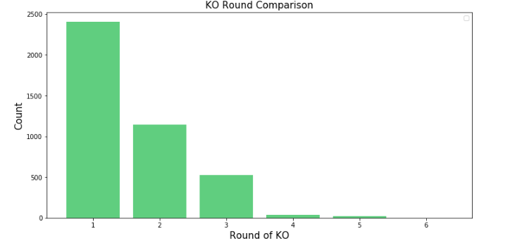

# High level overview of the project
The main purpose for this project is to understand which combination of martial arts are dominating wins in the UFC.
# Workflow
1. Scrape data from the http://ufcstats.com website.

    

2. Scrape data from wikipedia. (if time)
3. Data dump into MongoDB.
4. Curate dataset in MongoDB/Pandas/Postgres.
5. Develop a relational database in postgres. (if time)
6. EDA
7. Hypothesis Development.
8. t-test hypothesis.
9. Conclusions

# Data Scrapping
Most of the data is being scraped fro mthe http://ufcstats.com website into 2 main collections:
  1. Events
  2. Fighters
This is data dumped into MongoDB.

# Data dump into MongoDB
As mentioned before, two collections have been created including multiple fields for easy afterwards data manipulation. 

# Data curation process

# Relational Database development
4 tables will be included in this database:
  1. Events info
  
    - Event Name (name given to the event by the UFC)
    - Date (Date when the event happened)
    - Location (Location where the event happened)
    - Attendance (Number of attendance for each event)
  2. Events fights
  
    - Event Name (name given to the event by the UFC)
    - Winner (Name of the winner fighter)
    - Loser (Name of the loser fighter)
    - Weight Class (Weight class for the actual fight)
  3. Fighters info
  
    - Name (name given to the event by the UFC)
    - Nickname (Fighter's nickname)
    - Record (Wins/Loses/Draws record)
    - Height (Fighter's height)
    - Weight (Fighter's weight for the most recent fight)
    - Reach (Fighter's arm reach)
    - Stance (Fighter's stance)
    - DOB (Fighter's date of birth)
    - SLpM (Significant Strikes Landed per Minute)
    - Str_Acc (Significant Striking Accuracy)
    - SApM (Significant Strikes Absorbed per Minute)
    - Str_Def (Significant Strike Defence (the % of opponents strikes that did not land))
    - TD_Avg (Average Takedowns Landed per 15 minutes)
    - TD_Acc (Takedown Accuracy)
    - TD_Def (Takedown Defense (the % of opponents TD attempts that did not land))
    - Sub_Avg (Average Submissions Attempted per 15 minutes)
  4. Figters Fights 
  
    - f1 (Main fighter name)
    - f2  (Opponent name)
    - Event (Event name)
    - Date (Date of the fight)
    - f1.result (Main fighter result)
    - f1.str (Main fighter fight strikes)
    - f2.str (Opponent fight strikes)
    - f1.td  (Main fighter fight takedowns)
    - f2.td (Opponent fight takedowns)
    - f1.sub (Main fighter fight submission attempts)
    - f2.sub (Opponent fight submission attempts)
    - f1.pass (Main fighter fight passes)
    
# EDA
- The UFC has hosted over 450 events in the last 30 years.
- Almost 2000 fighters have participated in the UFC.

- Here is the evolution of attendance in the last 30 years.

    
### The Ronda Rousey fight in late 2015 holds the record attendance for the UFC. (56214 people)
    
- No surprises here. The US holds the record for more events.

- Top 5 countries for more events

- Fight class with more fights in the UFC. Are there more lightweight figters in the roster???

- KO/TKO is the most dominante winning method.

- For the KO/TKO method, fights are typically defined in the first round.

- Distribution of reach and height ratio.    

# Hypothesis Testing
#### Ho = No winning rate change between fighters with different Reach to Height ratio.
#### H1 = Better winning rate for fighters with higher Reach to Height ratio..
Take the top 10% reach to height ratio fighters and compare them with the rest.

`Test Statistic:` Perform a one tail ttest with a significance level of 0.05

- The t-test provided a p-value of `0.04879` allowing us to reget the null hypothesis.

# Next Steps

- Integrate wikipedia data with martial art background.
- Create a relational Database.
- Test the following list of hypothesis:

#### Null hypothesis 2: Fighters with Switch stance DO NOT win more fights. 
#### Alt hypothesis 2: Fighters with Switch stance win more fights.
Take all Switch fighters and compare records with the none switch
#### Null hypothesis 3: Fighters with high takedown accuracy (top 10%) DO NOT win more fights than fighters with high strike accuracy (top 10%).
#### Alt hypothesis 3: Fighters with high takedown accuracy (top 10%) win more fights than fighters with high strike accuracy (top 10%). 
Take the top 10% takedown accuracy fighters and compare them with the top 10%  strike accuracy fighters
#### Null hypothesis 4: Fighters 4 years (plus) younger than opponents DO NOT win more fights. 
#### Alt hypothesis 4: Fighters 4 years (plus) younger than opponents win more fights. 
Compare all the fightes with 4+ age difference.
#### Null hypothesis 5: Fighters DO NOT fight, in avg., 4 fights per year.
#### Alt hypothesis 5: Fighters fight, in avg., 4 fights per year.

- Determine which combination of martial arts are more likely to win fights. 
